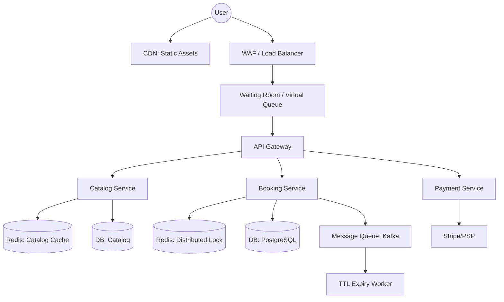

# System Design: Event Ticket Booking (Ticketmaster / BookMyShow)

## 1. Requirement Clarification

### Functional Requirements (FR)
- Users can browse events, view seating map, select specific seats.
- Users can reserve seats, pay, and receive an e-ticket.
- **Deep Dive**: Handle flash sales (e.g., Taylor Swift tickets).

### Non-Functional Requirements (NFR)
- High availability for browsing; High consistency (ACID) for booking.
- Handle **10K concurrent bookings** for one event (flash sale).
- No double-booking (strong consistency).
- **Latency**: <5s booking flow.

## 2. Back-of-the-Envelope Estimation

| Metric | Calculation / Estimation | Result |
| :--- | :--- | :--- |
| **DAU [Daily Active Users]** | 10 Million | 10M |
| **QPS [Queries Per Second]** | Browsing: 10M / 100K (secs in day) * 10 | ~1,000 QPS (Avg) |
| **Peak QPS (Flash Sale)** | 100K users hitting refresh at once | 100,000 QPS |
| **Booking QPS** | 10K seats / 5 minutes | ~30 QPS (Avg), 10K peak |
| **Storage (Tickets)** | 10M tickets/year * 1KB | 10 GB/year |

> **Interview Tip**: Emphasize the difference between read volume (browsing) and write volume (booking). High reads require caching, high concurrent writes to a limited resource require careful locking.

## 3. System Interface Definition

- `GET /v1/events/{event_id}/seats` -> `List[Seat]`
- `POST /v1/bookings/reserve` -> `BookingID`
  - Body: `{ user_id, event_id, list_of_seat_ids }`
- `POST /v1/bookings/confirm` -> `TicketID`
  - Body: `{ booking_id, payment_token }`

## 4. Database Design (Data Model)

**Relational Database (RDBMS)** - PostgreSQL (Need ACID properties).

**Seat Table** (Crucial for concurrency)
- `seat_id` (PK)
- `event_id` (FK)
- `status`: `AVAILABLE`, `RESERVED`, `BOOKED`
- `lock_timestamp`: When the seat was reserved (for TTL).

**Booking Table**
- `booking_id` (PK)
- `user_id` (FK)
- `status`: `PENDING_PAYMENT`, `COMPLETED`, `CANCELLED`

## 5. High-Level Design (Architecture)



### ASCII Architecture Flow
```text
[Client] --> [Waiting Room] --> [Load Balancer] --> [Booking Service]
                                                       |   |
     [TTL Expiry Worker] <--- [Kafka Queue] <----------+   +---> [Redis SETNX (Locks)]
             |                                             |
             +----------------> [PostgreSQL: Seat DB] <----+
```

## 6. Detailed Design (Deep Dives)

### 6.1 Seat Locking: Temporary Hold with TTL [Time To Live]
When a user selects seats, we must lock them temporarily while they pay.
- **Optimistic Locking**: Using a version number. Good for low contention.
- **Pessimistic Locking**: `SELECT ... FOR UPDATE`. Good for high contention but limits throughput.
- **Distributed Lock (Chosen)**: Use Redis to handle high QPS without hitting the database immediately.

### 6.2 Core Logic: Distributed Locking with Redis
We use `SETNX` (SET if Not eXists) to atomically acquire a lock with an expiry.

```python
def reserve_seats(user_id, event_id, seat_ids):
    # 1. Acquire distributed lock for each seat
    locked_seats = []
    try:
        for seat in seat_ids:
            lock_key = f"lock:seat:{event_id}:{seat}"
            # SETNX with 10 min expiry
            if redis.set(lock_key, user_id, nx=True, ex=600):
                locked_seats.append(seat)
            else:
                raise Exception(f"Seat {seat} already reserved.")
                
        # 2. Update DB transactionally
        db.begin_transaction()
        for seat in locked_seats:
            db.execute("UPDATE seats SET status='RESERVED' WHERE id=? AND status='AVAILABLE'", seat)
        booking_id = create_booking(user_id, locked_seats)
        db.commit()
        
        # 3. Queue task to check if payment is completed after 10 mins
        kafka.publish("booking_ttl", {"booking_id": booking_id}, delay=600)
        
        return booking_id
        
    except Exception as e:
        # Rollback locks if anything fails
        for seat in locked_seats:
            redis.delete(f"lock:seat:{event_id}:{seat}")
        db.rollback()
        raise e
```

### 6.3 Handling Flash Sales: Waiting Room Pattern
To protect the backend from a massive surge (e.g., 1 million users for 50K tickets):
1. **Virtual Queue**: Users are placed in a queue (e.g., Cloudflare Waiting Room).
2. **Token Issuance**: Users are let into the system in batches (e.g., 5,000 per minute).
3. **Validation**: Requests to backend must carry a signed JWT token proving they passed the waiting room.

## 7. Bottlenecks & Fault Tolerance

- **Redis Failure**: If Redis crashes, locks are lost. Use Redis Cluster (master-slave) for HA.
- **TTL Worker Failure**: Use dead-letter queues. If the TTL worker dies, another consumer picks up the Kafka message to release unpaid seats.
- **Database Hotspots**: Shard the seat database by `event_id`.

## 8. Summary & Interview Tips

- **Tip 1**: Always clarify if seats are assigned (movies) or general admission (concerts). General admission is easier (just a counter), assigned seats require row-level locking.
- **Tip 2**: Mention "Double Booking" as the critical failure mode. Explain how `SETNX` or RDBMS unique constraints prevent it.
- **Tip 3**: The Waiting Room pattern is a massive positive signal for senior roles. It shows you know how to protect infrastructure from DDOS-like traffic during flash sales.
