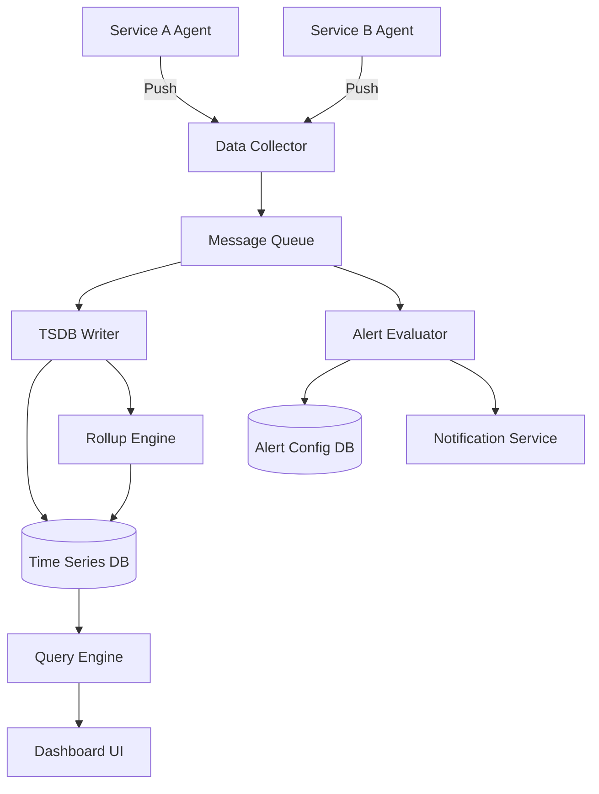

# System Design: Monitoring & Alerting System (Datadog/Prometheus)

## 1. Requirements

### Functional Requirements (FR)
- Collect metrics from various services and infrastructure.
- Store time-series data efficiently.
- Provide querying and dashboards.
- Alerting rules evaluation and notification.
- Anomaly detection.

### Non-Functional Requirements (NFR)
- High Write Throughput: 100M data points/min.
- Retention: 30-day retention at full resolution, downsampled for longer.
- Low Latency: <30s alert delay.
- High Availability.

## 2. Terminology & Concepts
- **TSDB** (Time-Series Database): Database optimized for time-stamped data.
- **Roll-ups / Down-sampling**: Aggregating older high-resolution data into lower-resolution points to save space.
- **Hysteresis**: Using two different thresholds for triggering and resolving alerts to prevent flapping (rapidly switching states).
- **Push vs. Pull Model**:
  - **Push** (e.g., Datadog): Agents push data to the centralized collector. Good for ephemeral jobs.
  - **Pull** (e.g., Prometheus): Central server scrapes endpoints. Easier to configure network/firewall (only server needs outbound access), harder for short-lived batch jobs.

## 3. Back-of-the-Envelope Estimation

| Metric | Calculation | Result |
|---|---|---|
| Write QPS | 100M / 60s | ~1.6M QPS |
| Storage per point | Timestamp (8B) + Value (8B) + Tags (~14B) | ~30 Bytes/point |
| Storage / Day | 100M/min * 60 * 24 * 30B | ~4.3 TB/day |
| Storage / 30 Days | 4.3 TB * 30 | ~130 TB (full resolution) |

> [!TIP] **Interview Tip**
> Mention that TSDBs use specialized compression (like Gorilla compression) which reduces 30 bytes to ~2-3 bytes per point. So actual storage is ~10-15 TB for 30 days.

## 4. Architecture Diagram



### ASCII Architecture

```text
+----------+      +-----------+       +----------+       +-------+
|  Agents  | ---> | Collector | ----> |  Kafka   | ----> | TSDB  |
+----------+      +-----------+       +----------+       +-------+
                                           |                 |
                                           v                 v
                                      +----------+       +--------+
                                      | Alerting |       | Query  |
                                      | Engine   |       | Engine |
                                      +----------+       +--------+
                                           |                 |
                                           v                 v
                                      +----------+       +--------+
                                      | Notifier |       |   UI   |
                                      +----------+       +--------+
```

## 5. Core Components & Deep Dive

### Time-Series Storage (TSDB)
Optimized for sequential writes (appends). Data is usually partitioned by time and metric name.

### Push vs Pull Model
- **Prometheus (Pull)**: Centralized control, easy to detect if a target is down (scrape fails).
- **Datadog (Push)**: Agents push. Better for autoscaling environments where instances come and go rapidly.

### Down-sampling
Background jobs read full-resolution data (e.g., 10s intervals), compute min/max/avg, and write 1-minute or 5-minute resolution points.

## 6. Core Logic / Pseudocode

### Down-sampling Algorithm
```cpp
struct DataPoint {
    long timestamp;
    double value;
};

// Computes 1-minute rollups from 10-second data
void downsample(const string& metric, const vector<DataPoint>& raw_data) {
    map<long, vector<double>> buckets;
    
    // Group into 1-minute buckets (60000 ms)
    for (const auto& pt : raw_data) {
        long bucket_time = (pt.timestamp / 60000) * 60000;
        buckets[bucket_time].push_back(pt.value);
    }
    
    // Aggregate
    for (const auto& [time, values] : buckets) {
        double sum = 0, min_val = MAX_DOUBLE, max_val = MIN_DOUBLE;
        for (double v : values) {
            sum += v;
            min_val = min(min_val, v);
            max_val = max(max_val, v);
        }
        double avg = sum / values.size();
        
        write_to_tsdb(metric + "_1m_avg", time, avg);
        write_to_tsdb(metric + "_1m_max", time, max_val);
    }
}
```

### Alerting Evaluation Engine (with Hysteresis)
```cpp
class AlertRule {
public:
    double trigger_threshold;
    double resolve_threshold;
    bool is_firing = false;
    
    void evaluate(double current_value) {
        if (!is_firing && current_value > trigger_threshold) {
            is_firing = true;
            send_alert("Triggered!");
        } else if (is_firing && current_value < resolve_threshold) {
            is_firing = false;
            send_alert("Resolved.");
        }
        // If current_value is between thresholds, state remains unchanged (Hysteresis)
    }
};
```

## 7. Failure Scenarios & Scaling
- **High Cardinality**: Too many unique tags (e.g., user_id) blows up the index. Solution: Restrict tag cardinality, use bloom filters.
- **Collector Failure**: Run stateless collectors behind a load balancer. Buffer data in Kafka.
- **Alerting Delay**: If Kafka lags, alerts are delayed. Solution: Dedicated topic/partition for high-priority metrics.

## 8. Interview Tips
- Mention Gorilla compression (XOR delta encoding) for TSDB storage.
- Discuss how out-of-order data points are handled.
- Highlight the importance of hysteresis in alerting to avoid spamming on-call engineers.
