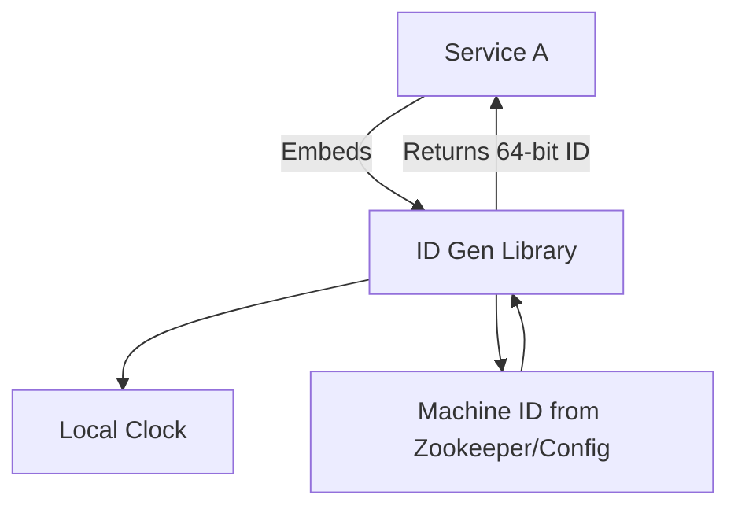

# System Design: Distributed ID Generator (Snowflake)

## 1. Requirements

### Functional Requirements (FR)
- Generate unique IDs.
- IDs should be sortable by time (roughly).
- IDs must be 64-bit integers (fits in standard DB BIGINT).

### Non-Functional Requirements (NFR)
- High throughput: 10K IDs/sec per server.
- Low latency.
- Highly available and distributed (no central coordination during generation).

## 2. Terminology & Concepts
- **UUID** (Universally Unique Identifier): 128-bit, huge collision space, but not time-sortable and large for DB primary keys.
- **Snowflake ID**: Twitter's open-source 64-bit ID format. Time-based, sortable, decentralised.
- **Clock Skew**: Servers having slightly different times via NTP sync. NTP can jump backwards, breaking monotonicity.
- **Auto-increment with step**: DB approach where Server A generates 1, 3, 5 and Server B generates 2, 4, 6.

## 3. Back-of-the-Envelope Estimation
- Length: 64 bits.
- 41 bits timestamp (milliseconds): `2^41 / (1000 * 3600 * 24 * 365)` = ~69 years.
- 10 bits machine ID: 1024 unique machines.
- 12 bits sequence number: 4096 IDs per millisecond per machine.
- Max throughput per machine: 4M IDs / second.

## 4. Architecture Diagram

### Snowflake Bit Layout
```text
 1 bit  |  41 bits (Timestamp in ms) | 10 bits (Machine ID) | 12 bits (Sequence)
--------|----------------------------|----------------------|--------------------
   0    |    10101010...101          |      1010101010      |    101010101010
```



## 5. Core Components & Deep Dive

### Alternatives Compared
1. **UUID v4**: 128-bit, purely random. Pros: Easy, no coordination. Cons: Too large (bad for B-Tree indexes), not time-sortable.
2. **DB Auto-increment**: Centralized DB limits scaling. Multi-master with step size works but is hard to scale out dynamically.
3. **Snowflake**: Best balance. 64-bit, fast, local generation, time-sortable.

### Handling Clock Backward Skew
If NTP syncs the clock backwards, sequence numbers might overlap with past IDs.
- **Solution**: Cache the last timestamp. If current time < last time, either:
  1. Wait until time catches up.
  2. Throw an exception.

## 6. Core Logic / Pseudocode

### Snowflake Implementation (C++)
```cpp
#include <iostream>
#include <chrono>
#include <stdexcept>
#include <mutex>

class Snowflake {
private:
    const long twepoch = 1288834974657L; // Custom epoch (e.g., Nov 04 2010)
    const long machineIdBits = 10L;
    const long sequenceBits = 12L;
    
    const long maxMachineId = -1L ^ (-1L << machineIdBits); // 1023
    const long sequenceMask = -1L ^ (-1L << sequenceBits);  // 4095
    
    const long machineIdShift = sequenceBits; // 12
    const long timestampLeftShift = sequenceBits + machineIdBits; // 22
    
    long machineId;
    long sequence = 0L;
    long lastTimestamp = -1L;
    
    std::mutex mtx;

    long timeGen() {
        auto now = std::chrono::system_clock::now().time_since_epoch();
        return std::chrono::duration_cast<std::chrono::milliseconds>(now).count();
    }

    long tilNextMillis(long lastTs) {
        long ts = timeGen();
        while (ts <= lastTs) {
            ts = timeGen();
        }
        return ts;
    }

public:
    Snowflake(long machine_id) {
        if (machine_id > maxMachineId || machine_id < 0) {
            throw std::invalid_argument("Machine ID out of bounds");
        }
        machineId = machine_id;
    }

    long nextId() {
        std::lock_guard<std::mutex> lock(mtx);
        long timestamp = timeGen();

        if (timestamp < lastTimestamp) {
            throw std::runtime_error("Clock moved backwards. Refusing to generate id");
        }

        if (lastTimestamp == timestamp) {
            sequence = (sequence + 1) & sequenceMask;
            if (sequence == 0) {
                // Sequence exhausted in this millisecond, wait for next
                timestamp = tilNextMillis(lastTimestamp);
            }
        } else {
            sequence = 0L;
        }

        lastTimestamp = timestamp;

        return ((timestamp - twepoch) << timestampLeftShift) |
               (machineId << machineIdShift) |
               sequence;
    }
};
```

## 7. Failure Scenarios & Scaling
- **Machine ID Collision**: Use Zookeeper or etcd to lease machine IDs to nodes on startup.
- **Clock drift**: If clock goes backward, pause generation or use a logical clock offset.

## 8. Interview Tips
- Mention **ULID** or **Sonyflake** as modern alternatives.
- Explain why 64-bit is important (fits in DB BIGINT, efficient B-tree indexing).
- Be prepared to write the bitwise shifts in code!
